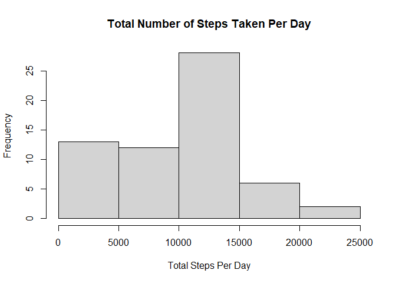
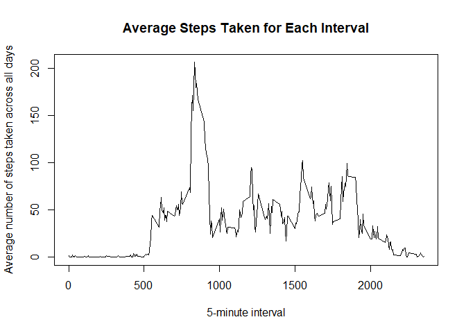
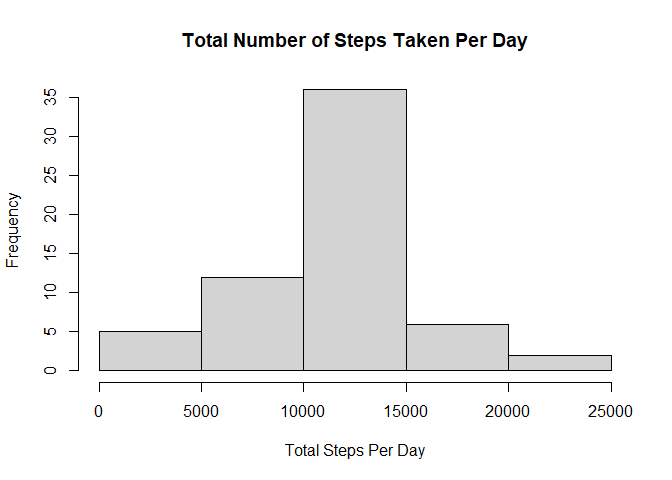
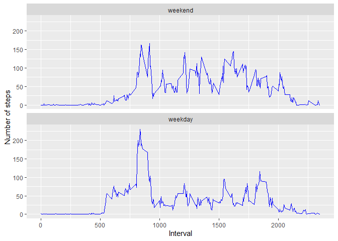

## Loading and preprocessing the data
First reading in the data and converting the date column from character to a date format. Converting to tbl_df format

```r
df <- read.csv("activity.csv",header = TRUE, stringsAsFactors = FALSE)
str(df)
```

```
## 'data.frame':	17568 obs. of  3 variables:
##  $ steps   : int  NA NA NA NA NA NA NA NA NA NA ...
##  $ date    : chr  "2012-10-01" "2012-10-01" "2012-10-01" "2012-10-01" ...
##  $ interval: int  0 5 10 15 20 25 30 35 40 45 ...
```

```r
df$date = as.Date(df$date, format="%Y-%m-%d")
library(tidyverse)
```

```
## -- Attaching packages --------------------------------------- tidyverse 1.3.0 --
```

```
## v ggplot2 3.3.2     v purrr   0.3.4
## v tibble  3.0.4     v dplyr   1.0.2
## v tidyr   1.1.2     v stringr 1.4.0
## v readr   1.4.0     v forcats 0.5.0
```

```
## -- Conflicts ------------------------------------------ tidyverse_conflicts() --
## x dplyr::filter() masks stats::filter()
## x dplyr::lag()    masks stats::lag()
```

```r
df <- as_tibble(df)
```
## What is mean total number of steps taken per day?


```r
df1 <- df %>% 
  group_by(date) %>%
  summarise(total = sum(steps, na.rm=TRUE), .groups="keep")

hist(df1$total, main="Total Number of Steps Taken Per Day", xlab="Total Steps Per Day")
```

<!-- -->

```r
mean(df1$total)
```

```
## [1] 9354.23
```

```r
median(df1$total)
```

```
## [1] 10395
```
* Mean of the total number of steps taken per day : 9354.23
* Median of the total number of steps taken per day :10395

## What is the average daily activity pattern?

```r
df2 <- df %>% 
  group_by(interval) %>%
  summarise(avg = mean(steps, na.rm=TRUE),.groups="keep")
with(df2, plot(interval, avg, main="Average Steps Taken for Each Interval", xlab = "5-minute interval", ylab = "Average number of steps taken across all days", type = "l"))
```

<!-- -->

```r
maximum <- subset(df2, avg==max(avg))
```
5-minute interval, on average, across all days in the dataset, that contains the maximum number of steps : **Interval 835**

## Imputing missing values
Filling in missing values with the mean for that 5-minute interval across all days 

```r
sum(!complete.cases(df))
```

```
## [1] 2304
```

```r
data_impute <- df %>%
  group_by(interval) %>%
  mutate(steps = ifelse(is.na(steps), mean(steps, na.rm=TRUE), steps))

df3 <- data_impute %>% 
  group_by(date) %>%
  summarise(total = sum(steps, na.rm=TRUE), .groups="keep")

hist(df3$total, main="Total Number of Steps Taken Per Day", xlab="Total Steps Per Day")
```

<!-- -->

```r
mean(df3$total)
```

```
## [1] 10766.19
```

```r
median(df3$total)
```

```
## [1] 10766.19
```
* Total number of rows with NAs : 2304
* Mean total steps taken per day : 10766.19
* Median total steps taken per day : 10766.19
* These values are higher than the mean and median values obtained in the first part of the assignment
* Imputing data increases the estimates of the total daily number of steps

## Are there differences in activity patterns between weekdays and weekends?

```r
data_impute <- data_impute %>% 
  mutate(wday = weekdays(date)) %>%
  mutate(factor_wday= ifelse(wday %in% c("Saturday","Sunday") , "weekend", "weekday")) 
  
data_impute$factor_wday <- factor(data_impute$factor_wday, levels = c("weekend", "weekday"))
df4 <- aggregate(data_impute$steps, data=data_impute,by=list(data_impute$factor_wday, data_impute$interval), mean)
names(df4) = c("wday", "interval", "steps")

library(ggplot2)
g <- ggplot(data=df4, aes(interval, steps))
g1 <- g  + facet_wrap(vars(wday), nrow=2, ncol=1) + geom_line(col="blue") + labs(x = "Interval", y= "Number of steps")
show(g1)
```

<!-- -->
